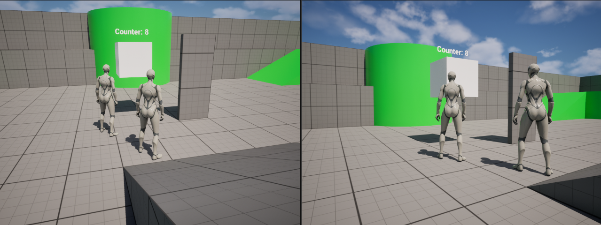
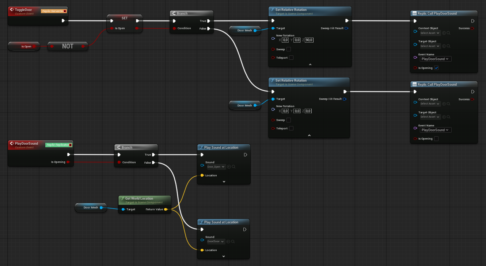
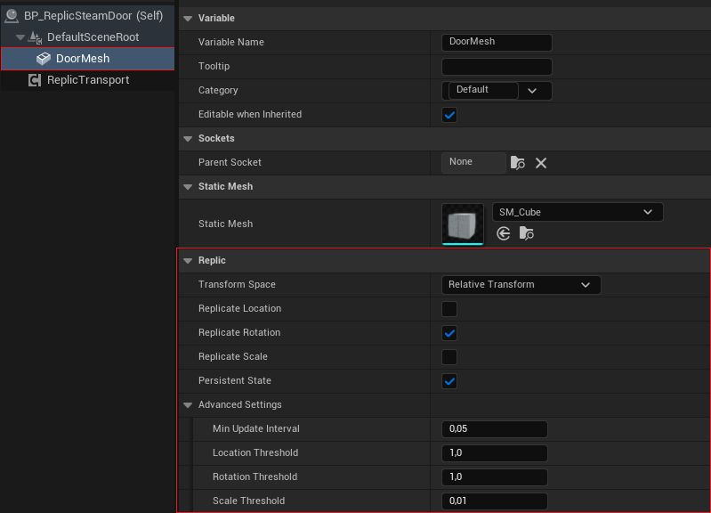
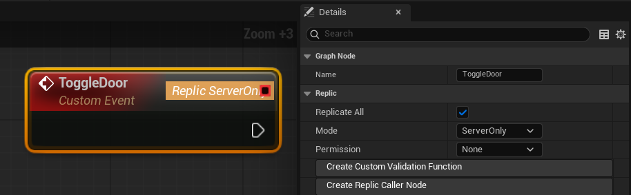
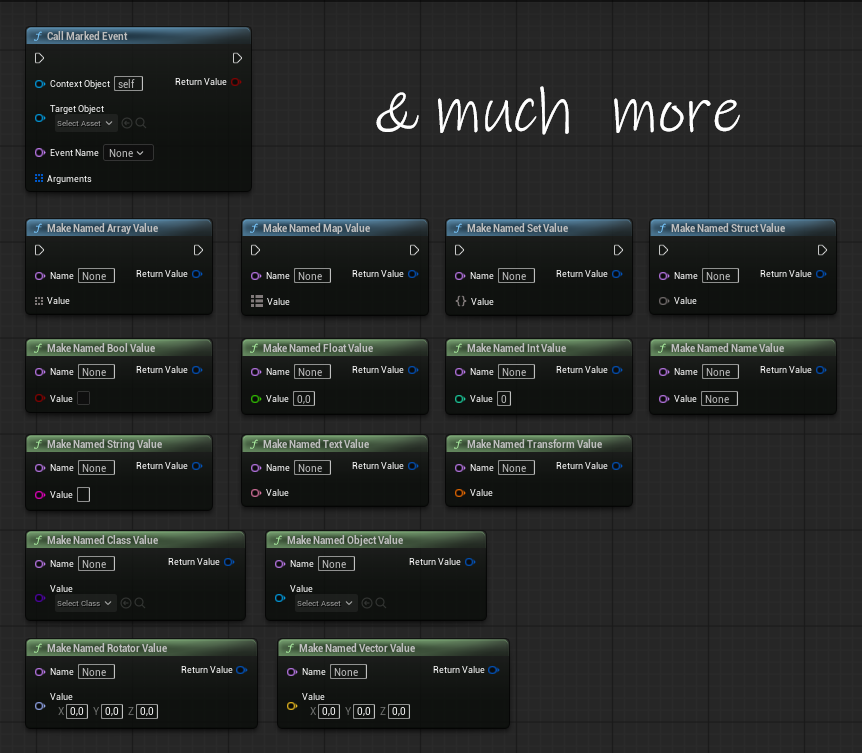

# Replic

Replic is a Blueprint-first replication plugin for Unreal Engine 5.6.

It provides explicit Blueprint nodes for replicated property writes, reads, events, observers, permissions, persistent late-join state, and component transform replication.

Current version: `0.2.1`

## Preview



<table>
  <tr>
    <td align="center" width="50%">
      <br>
      <sub>Replicated door logic with server-side state and replicated sound trigger</sub>
    </td>
    <td align="center" width="50%">
      <br>
      <sub>Component transform replication with persistent late-join state</sub>
    </td>
  </tr>
  <tr>
    <td align="center" width="50%">
      <br>
      <sub>Custom event replication settings directly in Blueprint details</sub>
    </td>
    <td align="center" width="50%">
      <br>
      <sub>Typed named values for replicated event arguments</sub>
    </td>
  </tr>
</table>

## Features

- Runtime transport component for replicated actors
- Replic-marked Blueprint variables
- Explicit setter and getter nodes
- Replicated custom events
- Typed event arguments
- Replicable sound triggers through Replic events
- Array, set, and map support
- Container delta operations
- Property change observers
- Persistent state for late joiners
- Permission modes:
  - `None`
  - `OwnerOnly`
  - `ServerOnly`
  - `Custom`
- Scene component transform replication:
  - relative or world transform
  - location, rotation, and scale channels
  - optional persistent transform state

## Requirements

- Unreal Engine 5.6
- Visual Studio 2022 with C++ build tools

## Installation

Copy the plugin into your Unreal project:

```text
YourProject/Plugins/Replic
```

Then open the project and enable the plugin if needed.

## Basic Usage

1. Enable `Replicates` on the actor that owns the replicated state.
2. Add `ReplicTransportComponent` to that actor.
3. Create a Blueprint variable or custom event.
4. Enable the Replic settings in the Details panel.
5. Use Replic nodes such as:
   - `Set Marked Int`
   - `Get Marked Int`
   - `Replic Set Array`
   - `Add To Marked Array`
   - `Replic Call Event`
   - `Bind Marked Property Changed`

For one-shot sounds such as doors, pickups, buttons, or impacts, trigger `Play Sound at Location` from a Replic custom event. Use persistent state for the gameplay result, not for replaying old sounds to late joiners.

For actor state changes, keep gameplay authority on the server and replicate the visible result. A common pattern is:

- `ServerOnly` event for the authoritative state change
- `ReplicateAll` event for one-shot cosmetic effects such as sounds
- persistent property or component transform state for late joiners

See [QuickStart](Docs/QuickStart.md) for a small counter, door, and sound workflow.

## Packaging Note

For packaged builds, use a C++ project or an equivalent C++ build setup so Unreal can build and link the plugin runtime module.

## License

MIT License. See `LICENSE`.

## Star History

<a href="https://www.star-history.com/?repos=bepooint%2FReplic&type=date&legend=top-left">
 <picture>
   <source media="(prefers-color-scheme: dark)" srcset="https://api.star-history.com/chart?repos=bepooint/Replic&type=date&theme=dark&legend=bottom-right" />
   <source media="(prefers-color-scheme: light)" srcset="https://api.star-history.com/chart?repos=bepooint/Replic&type=date&legend=bottom-right" />
   
 </picture>
</a>
